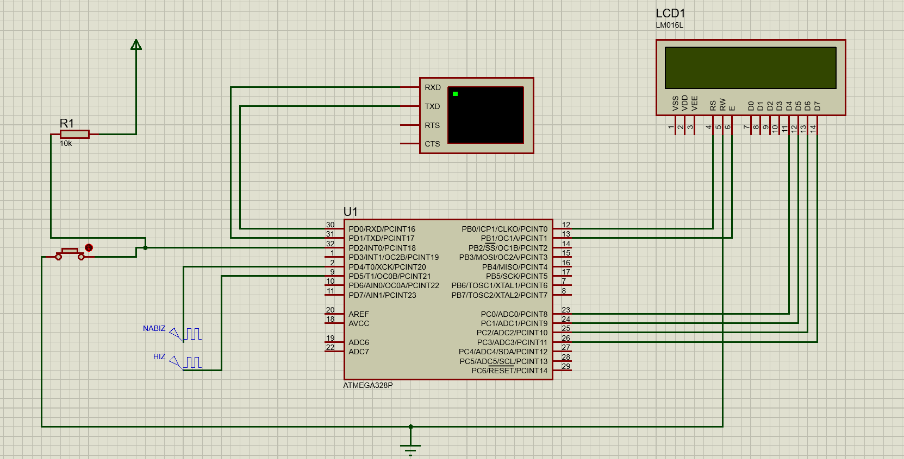
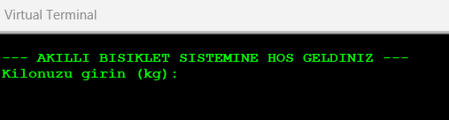
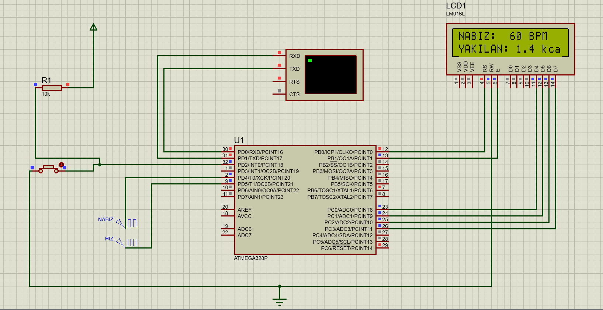
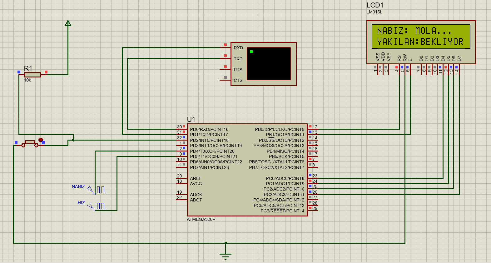

# Akıllı Kondisyon Bisikleti Monitörü (Bare-Metal AVR C) 🚴‍♂️💻

Bu proje, bir ATmega328P mikrodenetleyicisinin donanım birimlerinin (Timer, UART, External Interrupt, GPIO) hiçbir dış kütüphane (örneğin Arduino kütüphaneleri) kullanılmadan, tamamen **veri yolu yazmaçları (Register-Level) seviyesinde** saf C dili ile programlandığı gömülü sistemler projesidir. 

Sistem; UART üzerinden kullanıcıdan interaktif olarak kilo ve hedef kalori (örn: Kastamonu Tiriti veya Elbistan Tava menüleri) bilgisini alır. Ardından optik/manyetik sensörlerden gelen nabız ve pedal hızı frekanslarını arka planda donanımsal sayıcılarla (Timer) hesaplayarak MET (Metabolik Eşdeğer) formülü üzerinden anlık yakılan kaloriyi özel yazılmış bir sürücü ile LCD ekrana aktarır.

## 🚀 Projenin Teknik Kazanımları ve Özellikleri

* **Durum Makinesi (State Machine):** Sistem; Bekleme, Aktif, Mola ve Hedef Tamamlandı olmak üzere 4 farklı senaryoyu yönetecek bir State Machine mimarisiyle tasarlanmıştır. Hedefe ulaşıldığında sistem otomatik kilitlenir.
* **İnteraktif UART Menüsü:** Kullanıcı, bilgisayar terminali üzerinden sistemi yapılandırabilir. RX kesmeleri ve özel tampon bellekle (buffer) ASCII karakterleri tamsayılara (atoi) dönüştürülür.
* **Donanımsal Sayıcılar (Hardware Timers):** Ana CPU döngüsünü (loop) meşgul etmeden, dış pinlerden (T0 ve T1) gelen sinyalleri asenkron olarak saymak için Timer0 ve Timer1 modülleri yapılandırılmıştır.
* **Dış Kesmeler (External Interrupts):** Sistemi duraklatmak/başlatmak için sürekli pin okuma (Polling) yöntemi yerine, anında tepki veren INT0 donanımsal kesmesi (Hardware Interrupt) kullanılmıştır.
* **Bloke Etmeyen Gecikme (Non-Blocking Delay):** Ana döngüdeki bekleme süreleri parçalanarak, sistemin donanımsal kesmelere anında ("gecikmesiz") yanıt vermesi sağlanmıştır.
* **Kütüphanesiz 4-Bit LCD Sürücü (Bare-Metal Driver):** Standart `LiquidCrystal` kütüphanesi yerine, işlemcinin C Portu (PC0-PC3) üzerinden veri hatlarını süren özel bir sürücü mimarisi geliştirilmiştir.

## 🛠️ Kullanılan Teknolojiler ve Araçlar
* **Mikrodenetleyici:** ATmega328P (16 MHz Harici Kristal Konfigürasyonu)
* **Yazılım Dili:** Gömülü C (AVR-GCC)
* **Simülasyon Ortamı:** Proteus ISIS

## 🔌 Donanım Mimarisi ve Pin Bağlantıları

| Donanım Birimi | ATmega328P Pini | Fonksiyon / Register Modülü |
| :--- | :--- | :--- |
| **Nabız Sensörü** | PD4 | Timer0 (T0 Dış Saat Girişi) |
| **Pedal Sensörü**| PD5 | Timer1 (T1 Dış Saat Girişi) |
| **Duraklatma Butonu** | PD2 | Dış Kesme 0 (INT0) |
| **LCD Veri (D4-D7)** | PC0, PC1, PC2, PC3 | GPIO (Port C) |
| **LCD Kontrol (RS, E)** | PB0, PB1 | GPIO (Port B) |
| **PC Terminal (UART)** | PD0 (RX), PD1 (TX)| UART Modülü (RXEN0, TXEN0) |

## 📸 Ekran Görüntüleri ve Simülasyon

*Sistemin Proteus üzerindeki genel bağlantı şeması.*

*Sistem açılışında kullanıcıdan kilo ve hedef kalori verilerinin UART üzerinden interaktif olarak alınması.*

*Sistem çalışırken anlık BPM, RPM ve kalori hesabının LCD ekran sürücüsü ile gösterimi.*

*Donanımsal kesme (Interrupt) ile sistemin duraklatılması ve hedefe ulaşıldığındaki durum.*

## ⚙️ Nasıl Çalıştırılır?
1. Repoyu bilgisayarınıza klonlayın.
2. `smart_bike_simulation.pdsprj` Proteus proje dosyasını açın.
3. ATmega328P entegresine çift tıklayarak repodaki güncel `.hex` dosyasını `Program File` kısmına tanımlayın.
4. `Clock Frequency` değerini **16MHz** ve `CKSEL Fuses` değerini **Ext. Crystal** olarak ayarladığınızdan emin olun.
5. Simülasyonu başlatın ve Virtual Terminal üzerinden sistemle etkileşime geçin.

---
*Bu proje, gömülü sistemler teorisinin ve mikrodenetleyici mimarisinin temel yapı taşlarını pratiğe dökmek amacıyla geliştirilmiştir.*
